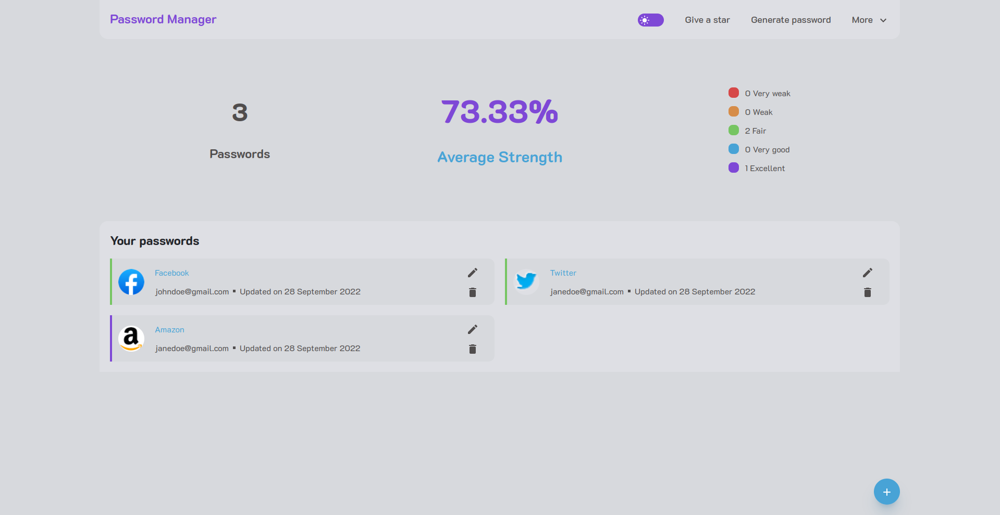
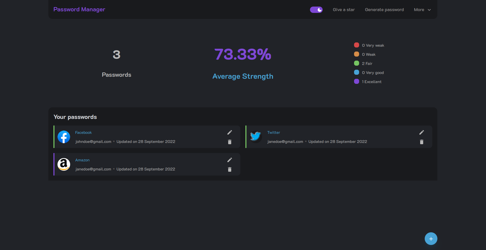

# Password Manager

## Description

We all face the problem of remembering our passwords. With the increase in cyber crime, it has almost become a mandate
to use strong passwords. Not only that, providers as us to put separate passwords for separate purposes and also
sometimes, we have to set gibberish(hash) as password. It is not possible by any means to remember all the passwords.
This password manager brings in the solution to these problems by securely storing the passwords in you own system.
View, add and edit them whenever you want to.

## Tech stack

- ReactJS
- TailwindCSS
- Typescript
- NodeJS
- Redux
- Vite

## Steps to run locally

- `git clone https://github.com/rajdip-b/password-manager`
- `cd password-manager`
- `npm i`
- `npm run dev`
